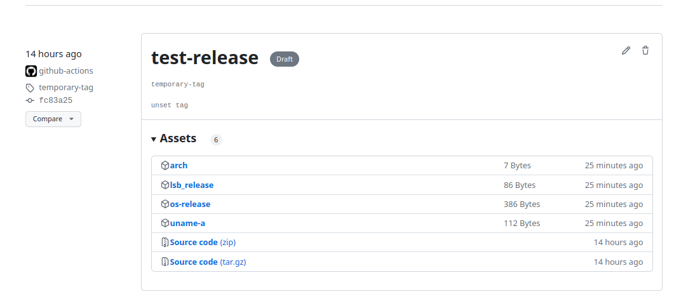

# test-project

为了使用 Github Action 所创建的项目


1. 创建一个工作流

```shell
# 创建一个目录用于存放工作流配置
mkdir -p .github/workflows

touch .github/workflows/test.yml
```

2. 为工作流命名

```yml
name: Tets Action
```

3. 为工作流配置在 master 分支中 push 时才触发该工作

```yml
on:
  push:
    branches:
      - master
```

4. 创建一个任务, 该 build 任务是在最新 ubuntu 环境中运行

```yml
jobs:
  build:
    runs-on: ubuntu-latest
```

5. 配置该任务的详细步骤

    些任务在配置前期进行过一系列常规的在 Linux 系统中的操作

    1. 如果你想查看系统信息

    ```yml
    - run: echo "hello world"
    - run: pwd
    - run: cat /etc/os-release  # 查看发行版本信息
    - run: uname -a             # 查看 Linux 信息
    - run: arch                 # 查看架构
    - run: lsb_release -a       # 使用更简单的方式查看发行信息
    - run: apt install neofetch -y
    - run: neofetch                # 在安装完成后执行
    ```

    2. 如果你想在构建过程中创建一些文件

    ```yml
    - run: mkdir artifacts
    - run: uname -a > artifacts/uname-a
    - run: lsb_release -a > artifacts/lsb_release
    # ...
    ```

    ```yml
    - run: pwd 
    # 它输出的路径是：
    # /home/runner/work/test-project/test-project
    ```

6. 使用 Github Actions 市场的一些比较好用的 Action

    1. 在 Action 中使用 Checkout Action 克隆本项目

    ```yml
    - name: Checkout
      uses: actions/checkout@v2.7.0

    # 将会将项目的内容检出到当前目录
    # /home/runner/work/test-project/test-project
    # 但是要注意，在使用这个 Action 时，目录中之前的内容会被清空
    # 可以在一开始就使用。
    ```

    2. 在 Action 中使用 Create Release Action 进行创建发布

    ```yml
    - name: Create Release
      uses: ncipollo/release-action@v1.12.0
      with:
        name: test-release # Release 的标题名称
        body: |
            This is the temporary release
            # 表示是在 Release 中写入的内容
        tag: temporary-tag
            # 一个可以忽略的 tag 标记，它会查找项目中的当前 tag
            # 如果没有可能会报错，所以可以指定一个
        draft: true
            # 表示是一个草稿形式的 Release 
        omitBody: true
            # 表示可以忽略 body 内容
        artifacts: "artifacts/*"
            # 表示上传的工件，也就是上传 artifacts 目录中所有的内容
            # 如果你使用 "./build/*.deb;./build/*.deb" 
            # 这种以 ; 分隔的多个匹配，是可以支持的
        token: ${{ secrets.GITHUB_TOKEN }}
            # token 是最重要的部分，而 GITHUB_TOKEN 是默认的
            # 当你在该项目的 Settings -> Actions -> 
            # Workflow permissions 小节中，配置了 read/write 权限
            # 则该 Action 使用 GITHUB_TOKEN 将有操作 Release 的权限
    ```

